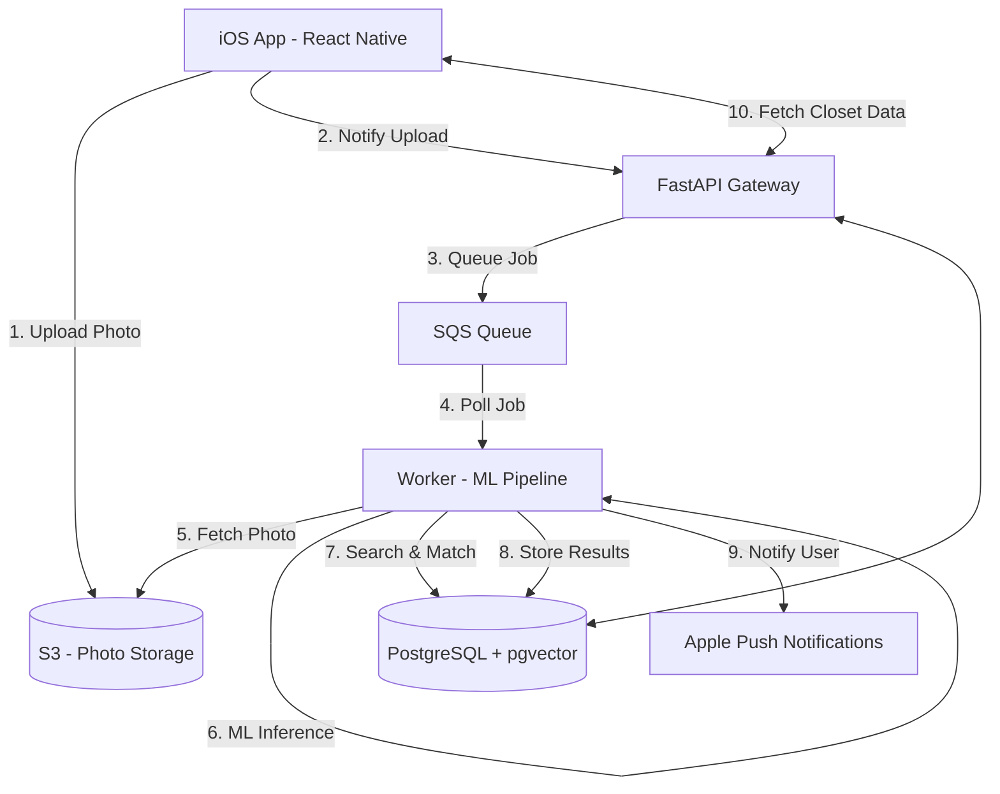

# High-Level Design: Digital Closet

## 1. Problem Statement & Goals

### 1.1 Problem Statement
Most people own far more clothing than they actively wear. Without visibility into their wardrobe usage, users repeatedly reach for the same items while others go untouched for months. Existing solutions require tedious manual input, which kills retention.

### 1.2 Vision
Digital Closet is a mobile-first iOS application that uses AI-powered computer vision to build a user's digital wardrobe automatically through daily outfit photos. The camera does the work, surfacing wear frequency, dormant items, and outfit patterns without manual data entry.

### 1.3 Core Goals
*   **Automated Wardrobe Building:** Identify and track clothing items from daily photos.
*   **Wear Tracking:** Log when items are worn to calculate frequency and "last worn" dates.
*   **Dormancy Alerts:** Surface items that haven't been worn in 30, 60, or 90 days.
*   **Zero-Effort UX:** Minimize user friction by handling the heavy lifting via an asynchronous AI pipeline.

---

## 2. Target Users & Personas

*   **The Intentional Consumer:** Users who want to be more mindful of their fashion consumption and ensure they are getting value from every item they own.
*   **The Minimalist:** Users looking to declutter their wardrobe by identifying and removing items they no longer wear.
*   **The Daily Logger:** Users who already take "Outfit of the Day" (OOTD) photos and want to turn that habit into actionable data.

---

## 3. System Architecture Overview

Digital Closet uses an event-driven, asynchronous architecture to handle compute-intensive ML tasks without blocking the user experience.

### 3.1 High-Level Diagram

### 3.2 Key Components
*   **iOS Client:** Native camera integration and direct-to-S3 uploads via pre-signed URLs.
*   **API Gateway (FastAPI):** Handles authentication, issues pre-signed URLs, and serves the "Read Path" for closet data.
*   **ML Worker (Python):** Executes the "Write Path" (Inference Pipeline) using YOLO for detection and CLIP for vector embeddings.
*   **PostgreSQL + pgvector:** Stores relational data and performs high-speed vector similarity searches.

---

## 4. Key Design Decisions & Trade-offs

*   **Server-Side Inference:** 
    *   *Decision:* Run ML models (YOLO, CLIP) on server-side GPUs rather than on-device.
    *   *Trade-off:* Increases infrastructure cost but ensures consistent accuracy and performance across all iOS devices.
*   **Asynchronous Processing:** 
    *   *Decision:* Decouple photo upload from processing via SQS.
    *   *Trade-off:* User doesn't see results instantly, but the app remains responsive. Push notifications bridge the gap.
*   **Cosine Similarity (pgvector):**
    *   *Decision:* Use cosine similarity for vector matching.
    *   *Trade-off:* Better at handling varying lighting/contrast conditions than Euclidean distance, though slightly more compute-intensive.
*   **Hybrid Matching Logic:**
    *   *Decision:* Use three confidence tiers (Auto-match, Prompt User, New Item).
    *   *Trade-off:* Balances automation with accuracy by involving the user only when confidence is middling.

---

## 5. Non-Goals (Out of Scope for MVP)

*   **Brand Recognition:** The AI will not attempt to identify brands or logos.
*   **Price Tracking:** No manual or automatic price entry or "cost-per-wear" analytics in the initial version.
*   **Social Features:** No sharing outfits, following users, or public closets.
*   **E-commerce Integration:** No "buy similar" links or shopping recommendations.
*   **Android Support:** The MVP is strictly iOS-first.

---

## 6. Infrastructure Stack (MVP)

| Component | Technology |
|-----------|------------|
| Frontend | React Native (iOS) |
| Backend | FastAPI (Python 3.12) |
| ML Frameworks | Ultralytics YOLO, OpenAI CLIP |
| Database | AWS RDS Postgres + pgvector |
| Message Queue | AWS SQS |
| Storage | AWS S3 |
| Notifications | Apple APNs |
